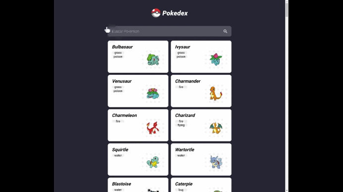

# Pokedex

<h1 align="center">
	
</h1>

## Sobre ##

Aplicação desenvolvida com [Angular CLI](https://github.com/angular/angular-cli) version 13.2.6.

## Funções ##

:heavy_check_mark: Buscar Pokemon;
:heavy_check_mark: Mostrar detalhes do Pokemon;

## Servidor de desenvolvimento

Execute `ng serve` para um servidor dev. Navegue até `http://localhost:4200/`. O aplicativo será recarregado automaticamente se você poderá alterar qualquer um dos arquivos de origem.

## Estrutura de código

Execute `ng generate component component-name` para gerar um novo componente. Você também pode usar `ng generate Directive|pipe|service|class|guard|interface|enum|module`.

## Construir

Execute `ng build` para compilar o projeto. Os artefatos de construção serão armazenados no diretório `dist/`.

## Executando testes de unidade

Execute `ng test` para executar os testes de unidade via [Karma](https://karma-runner.github.io).

## Executando testes de ponta a ponta

Execute `ng e2e` para executar os testes de ponta a ponta por meio de uma plataforma de sua escolha. Para usar este comando, você precisa primeiro adicionar um pacote que implemente recursos de teste de ponta a ponta.

## Mais ajuda

Para obter mais ajuda sobre a CLI Angular, use `ng help` ou confira a página [Visão Geral da CLI Angular e Referência de Comando](https://angular.io/cli).

## Information in english

## Development server

Run `ng serve` for a dev server. Navigate to `http://localhost:4200/`. The app will automatically reload if you change any of the source files.

## Code scaffolding

Run `ng generate component component-name` to generate a new component. You can also use `ng generate directive|pipe|service|class|guard|interface|enum|module`.

## Build

Run `ng build` to build the project. The build artifacts will be stored in the `dist/` directory.

## Running unit tests

Run `ng test` to execute the unit tests via [Karma](https://karma-runner.github.io).

## Running end-to-end tests

Run `ng e2e` to execute the end-to-end tests via a platform of your choice. To use this command, you need to first add a package that implements end-to-end testing capabilities.

## Further help

To get more help on the Angular CLI use `ng help` or go check out the [Angular CLI Overview and Command Reference](https://angular.io/cli) page.
